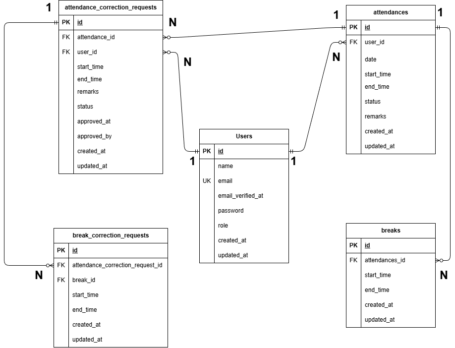

# COACHTECH 勤怠管理アプリ

COACHTECHが開発した独自の勤怠管理アプリケーション。  
ユーザーの勤怠登録・管理、修正申請、承認機能を備えた勤怠管理システム。

---

## 環境構築

### Dockerビルド
```bash
git clone git@github.com:Kumicho-naka/coachtech-attendance.git
cd coachtech-attendance
docker-compose up -d --build
```

### Laravel環境構築
```bash
docker-compose exec php bash
composer install
cp .env.example .env
php artisan key:generate
php artisan storage:link
php artisan migrate
php artisan db:seed
```

### .env設定

`.env`ファイルの以下の項目を設定してください：

#### データベース設定
```env
DB_CONNECTION=mysql
DB_HOST=mysql
DB_PORT=3306
DB_DATABASE=laravel_db
DB_USERNAME=laravel_user
DB_PASSWORD=laravel_pass
```

**Mailtrap設定（外部サービスを使用する場合）**
```env
MAIL_MAILER=smtp
MAIL_HOST=smtp.mailtrap.io
MAIL_PORT=2525
MAIL_USERNAME=your_mailtrap_username
MAIL_PASSWORD=your_mailtrap_password
MAIL_ENCRYPTION=tls
MAIL_FROM_ADDRESS=test@example.com
MAIL_FROM_NAME="${APP_NAME}"
```

> **Mailtrapの設定方法**:
> 1. https://mailtrap.io/ でアカウント作成（無料）
> 2. Inboxを作成
> 3. 「SMTP Settings」から認証情報をコピー
> 4. `.env`に貼り付け

設定後、キャッシュをクリア：
```bash
php artisan config:clear
```

---

## 使用技術（実行環境）
- PHP 8.1.33
- Laravel 8.83.29
- MySQL 8.0.26
- nginx 1.21.1
- Docker

**認証**
- Laravel Fortify 1.19.1

**メール送信**
- Mailtrap

---

## ER図


---

## URL
- 開発環境：http://localhost/
- phpMyAdmin：http://localhost:8080/

---

## アカウント情報

### 管理者アカウント
- メールアドレス: admin@example.com
- パスワード: password123

### 一般ユーザーアカウント
- メールアドレス: yamada@example.com
- パスワード: password123

その他のテストユーザー:
- sato@example.com / password123
- suzuki@example.com / password123

---

## 機能一覧

### 一般ユーザー機能
1. **会員登録**: http://localhost/register
2. **メール認証**: 会員登録時のメールアドレス認証
3. **ログイン**: http://localhost/login
4. **勤怠打刻**: ログイン後、勤怠画面で出勤・休憩・退勤の打刻
5. **勤怠一覧**: 自分の勤怠履歴を月別で確認
6. **勤怠詳細・修正申請**: 各日の勤怠詳細を確認し、修正が必要な場合は申請
7. **申請一覧**: 自分が行った修正申請の状況確認（承認待ち/承認済み）

### 管理者機能
1. **ログイン**: http://localhost/admin/login
2. **日次勤怠一覧**: 日別で全スタッフの勤怠を確認
3. **スタッフ一覧**: 全スタッフの一覧表示
4. **スタッフ別勤怠一覧**: スタッフごとの月別勤怠確認とCSV出力
5. **勤怠詳細・修正**: 各勤怠の詳細確認と直接修正
6. **修正申請承認**: スタッフからの修正申請を承認

---

## テストの実行
```bash
php artisan test
```

---

## トラブルシューティング

### マイグレーションエラーが発生する場合
```bash
php artisan migrate:fresh --seed
```

### キャッシュのクリア
```bash
php artisan cache:clear
php artisan config:clear
php artisan route:clear
php artisan view:clear
```

### パーミッションエラーが発生する場合
```bash
chmod -R 777 storage bootstrap/cache
```